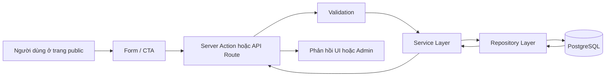
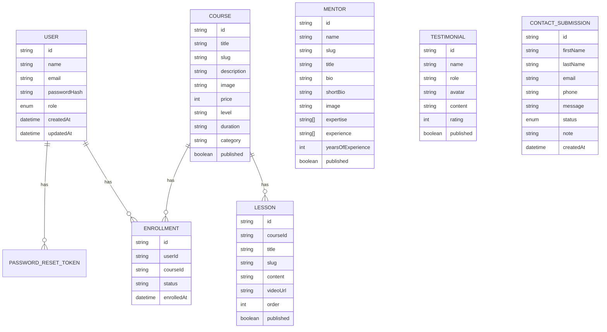

# PROJECT DOCUMENTATION

## 1. Tổng Quan Dự Án

### Tên dự án
Edu Hub

### Mục tiêu
Edu Hub là một website bán khóa học và nền tảng học trực tuyến toàn diện dùng để giới thiệu khóa học, mentor và tiếp nhận nhu cầu tư vấn của người dùng, đồng thời cung cấp môi trường học tập. Dự án giải quyết các bài toán trình bày nội dung đào tạo theo một luồng rõ ràng: người dùng xem khóa học, tham khảo mentor, đọc cảm nhận học viên, gửi form liên hệ để được tư vấn, hoặc đăng ký tài khoản để **trực tiếp mua và vào học ngay các bài học (video, content)**. Ở phía quản trị, admin có thể cập nhật nội dung khóa học, thêm sửa bài học giảng dạy và theo dõi lead phát sinh.

### Đối tượng sử dụng
- Người dùng phổ thông đang tìm khóa học hoặc mentor phù hợp.
- Học viên muốn đăng ký tài khoản, ghi danh khóa học (Enroll) và vào hệ thống (Dashboard) để học.
- Quản trị viên nội dung quản lý khóa học, bài học, mentor, cảm nhận và lead liên hệ.

## 2. Kiến Trúc Hệ Thống

### Tech Stack
- Frontend: Next.js 15 App Router, React 19, Tailwind CSS 4
- Backend: Next.js Route Handlers, Server Actions, NextAuth credentials
- Database: PostgreSQL qua Prisma ORM
- Hỗ trợ khác: Nodemailer, AOS, React Slick

### Kiến trúc tổng thể
Edu Hub được xây theo mô hình full-stack trong cùng một codebase Next.js:
- Tầng giao diện nằm trong `src/app` và `src/app/components`.
- Tầng xử lý nghiệp vụ nằm trong `src/server/services`.
- Tầng truy cập dữ liệu nằm trong `src/server/repositories`.
- Tầng dữ liệu được định nghĩa trong Prisma schema và lưu trên PostgreSQL.

### Workflow dữ liệu



### Luồng chính của bản demo
1. Người dùng vào trang chủ, xem `Khóa học`, `Mentor`, `Cảm nhận`.
2. Người dùng tạo tài khoản/Đăng nhập để vào không gian học tập.
3. Người dùng ghi danh (Enroll) khóa học, sau đó chuyển sang `Dashboard` cá nhân.
4. Từ `Dashboard`, học viên click `Vào học ngay` để truy cập trang bài học chi tiết bao gồm thanh điều hướng bài học và video player.
5. Người dùng gửi form ở trang `Liên hệ` (Lead generation).
6. Admin truy cập trang CMS để quản lý cấu trúc khóa học, thêm `Bài học` mới cho khóa học hoặc cập nhật trạng thái `Lead liên hệ`.

## 3. Cấu Trúc Thư Mục

### Cấu trúc chính

```text
src/
  app/
    (site)/            # Các trang public
    (admin)/admin/     # Giao diện quản trị
    api/               # Route handlers cho auth/admin
    components/        # UI components dùng lại
  server/
    auth/              # Xác thực, session, token, password
    services/          # Nghiệp vụ
    repositories/      # Tương tác dữ liệu
    content/           # Fallback content và service content
  data/                # Dữ liệu tĩnh cục bộ
  types/               # Kiểu dùng chung
  utils/               # Hàm tiện ích
prisma/
  schema.prisma        # Schema database
  seed.mjs             # Seed dữ liệu demo
public/
  data/                # Dữ liệu tĩnh public
  images/              # Ảnh và asset
```

### Giải thích các thư mục quan trọng
- `src/app/(site)`: chứa các route public như trang chủ, khóa học, mentor, cảm nhận, liên hệ và auth pages.
- `src/app/(admin)/admin`: chứa dashboard quản trị và các màn quản lý nội dung.
- `src/app/api`: chứa API route cho `next-auth` và các endpoint quản trị.
- `src/server/services`: nơi gom nghiệp vụ như signup, reset password, tạo contact submission, lấy nội dung published.
- `src/server/repositories`: lớp truy vấn Prisma, tách biệt với nghiệp vụ.
- `prisma`: định nghĩa database schema và dữ liệu seed dùng cho demo.
- `public`: nơi chứa hình ảnh và dữ liệu tĩnh phục vụ fallback hoặc giao diện.

## 4. Các Tính Năng Chính

### Khu vực public
- Trang chủ hiển thị hero, khóa học nổi bật, mentor, cảm nhận và form liên hệ.
- Trang `Khóa học` cho phép người dùng xem các nhóm nội dung đào tạo và click vào xem chi tiết nội dung.
- Trang `Khóa học Chi tiết` hiển thị thông tin sâu hơn, list bài học và cho phép học viên Enroll (Ghi danh).
- Trang `Dashboard` chứa danh sách khóa học mà người đăng nhập đã mua.
- Trang `Không gian Học tập` (Lesson Viewer) tích hợp video embed Youtube, tài liệu text.

### Khu vực auth
- Đăng ký tài khoản bằng email/password (giữ modal sau khi đăng ký để tiện đăng nhập ngay).
- Đăng nhập bằng credentials qua NextAuth.
- Quên mật khẩu và đặt lại mật khẩu qua token.

### Khu vực admin
- Quản lý khóa học (Courses).
- Quản lý nội dung bài học chuyên sâu (Lessons) và gán cho các khóa học.
- Quản lý mentor.
- Quản lý cảm nhận học viên.
- Theo dõi và cập nhật trạng thái lead liên hệ.

## 5. Thiết Kế Giao Diện

### Phong cách giao diện
- Dùng bố cục landing page hiện đại.
- Màu chủ đạo xoay quanh `primary` và nền sáng để phù hợp bản demo học thuật.
- Sử dụng card layout, CTA rõ ràng và nhiều section dạng giới thiệu nội dung.

### Điểm đáng chú ý
- Giao diện public ưu tiên luồng ra quyết định: khóa học -> mentor -> cảm nhận -> liên hệ.
- Giao diện admin đã được chuyển từ dạng JSON raw sang card/list dễ nhập liệu và dễ trình bày khi demo.
- Có preview ảnh trong màn quản trị để hạn chế lỗi nội dung.

## 6. Cơ Sở Dữ Liệu

### ERD khái quát



### Data Dictionary ngắn

#### `User`
- `role`: `ADMIN` hoặc `STUDENT`
- `email`: duy nhất, dùng cho đăng nhập
- `passwordHash`: mật khẩu đã mã hóa

#### `PasswordResetToken`
- `tokenHash`: token đã băm, không lưu token gốc
- `expiresAt`: thời gian hết hạn
- `usedAt`: đánh dấu token đã sử dụng

#### `Course`
- `slug`: định danh duy nhất cho khóa học
- `category`: nhóm nội dung như `webdevelopment`, `mobiledevelopment`, `datascience`, `cloudcomputing`
- `published`: quyết định có hiển thị trên site hay không

#### `Lesson`
- `courseId`: liên kết đến `Course` cha chứa bài học.
- `videoUrl`: link video Youtube dạng nhúng để hiển thị bài học.
- `order`: thứ tự xuất hiện của bài học.

#### `Enrollment`
- `status`: trạng thái khóa học đã mua `ACTIVE` hoặc `COMPLETED`.
- Bảng trung gian móc nối quan hệ Nhiều-Nhiều (M-N) giữa Học viên (`User`) và Khóa học (`Course`).

#### `Mentor`
- `expertise`: danh sách kỹ năng nổi bật
- `experience`: danh sách kinh nghiệm nổi bật
- `yearsOfExperience`: số năm kinh nghiệm để hiển thị trên giao diện

#### `Testimonial`
- `rating`: số sao từ 1 đến 5
- `published`: quyết định hiển thị trên site

#### `ContactSubmission`
- `status`: `NEW`, `CONTACTED`, `CLOSED`
- `note`: ghi chú nội bộ của admin

## 7. Tài Liệu API / Chức Năng Chính

### Server Actions

#### `submitContactAction`
- Mục đích: nhận dữ liệu form liên hệ từ trang public
- Đầu vào: `firstname`, `lastname`, `email`, `phnumber`, `Message`
- Xử lý: validate -> tạo `ContactSubmission`
- Đầu ra: `ActionState` gồm `success`, `message`, `code`

#### `signupAction`
- Mục đích: tạo tài khoản học viên
- Đầu vào: `name`, `email`, `password`
- Xử lý: validate -> kiểm tra email trùng -> hash password -> tạo user
- Đầu ra: `ActionState`

#### `forgotPasswordAction`
- Mục đích: tạo yêu cầu reset password
- Đầu vào: `email`
- Xử lý: tạo token, lưu hash token, gửi email hoặc log link nếu chưa có SMTP
- Đầu ra: `ActionState`

#### `resetPasswordAction`
- Mục đích: cập nhật mật khẩu mới từ token
- Đầu vào: `token`, `newPassword`, `confirmPassword`
- Xử lý: kiểm tra token, cập nhật password, đánh dấu token đã dùng
- Đầu ra: `ActionState`

### API Routes quan trọng

#### `GET/POST /api/admin/courses`
- `GET`: lấy danh sách khóa học cho admin
- `POST`: tạo khóa học mới

#### `PATCH/DELETE /api/admin/courses/[id]`
- `PATCH`: cập nhật khóa học
- `DELETE`: xóa khóa học

#### `GET/POST /api/admin/lessons`
- API chịu trách nhiệm truy vấn tập trung cho module bài giảng theo một khóa học cụ thể dành cho admin.

#### `PATCH/DELETE /api/admin/lessons/[id]`
- Các API route điều chỉnh CRUD cho bài học.

#### `GET/POST /api/admin/mentors`
- `GET`: lấy danh sách mentor cho admin
- `POST`: tạo mentor mới

#### `PATCH/DELETE /api/admin/mentors/[id]`
- `PATCH`: cập nhật mentor
- `DELETE`: xóa mentor

#### `GET/POST /api/admin/testimonials`
- `GET`: lấy danh sách cảm nhận
- `POST`: tạo cảm nhận mới

#### `PATCH/DELETE /api/admin/testimonials/[id]`
- `PATCH`: cập nhật cảm nhận
- `DELETE`: xóa cảm nhận

#### `GET /api/admin/contact-submissions`
- Mục đích: lấy danh sách lead liên hệ

#### `PATCH /api/admin/contact-submissions/[id]`
- Mục đích: cập nhật `status` và `note` cho lead

#### `GET/POST /api/auth/[...nextauth]`
- Mục đích: xử lý đăng nhập bằng NextAuth credentials

### Điều kiện bảo vệ API admin
- Tất cả endpoint admin yêu cầu `requireAdminSession()`.
- Middleware chặn truy cập `/admin/*` nếu chưa đăng nhập hoặc không phải admin.

## 8. Quy Trình Chạy Dự Án

### Cài đặt

```bash
npm install
cp .env.example .env
npx prisma generate
npx prisma migrate dev --name init
npm run prisma:seed
npm run dev
```

### Tài khoản admin mặc định khi seed
- Email: lấy từ `SEED_ADMIN_EMAIL`
- Password: lấy từ `SEED_ADMIN_PASSWORD`

### Build kiểm tra

```bash
npm run build
```

## 9. Hướng Dẫn Sử Dụng Admin

### Điều kiện để dùng admin
- Phải cấu hình database PostgreSQL trong file `.env`
- Phải chạy migrate và seed dữ liệu trước
- Phải đăng nhập bằng tài khoản có quyền `ADMIN`

### Các bước truy cập admin
1. Tạo file `.env` từ `.env.example`
2. Cập nhật tối thiểu các biến:
   - `DATABASE_URL`
   - `NEXTAUTH_SECRET`
   - `NEXTAUTH_URL`
3. Chạy các lệnh khởi tạo:

```bash
npx prisma generate
npx prisma migrate dev --name init
npm run prisma:seed
npm run dev
```

4. Mở trang đăng nhập:

```text
http://localhost:3000/signin
```

5. Đăng nhập bằng tài khoản admin được tạo từ seed:
   - Email: giá trị của `SEED_ADMIN_EMAIL`
   - Password: giá trị của `SEED_ADMIN_PASSWORD`

6. Sau khi đăng nhập thành công, truy cập:

```text
http://localhost:3000/admin
```

### Tài khoản admin mặc định
Nếu dùng nguyên file `.env.example`, tài khoản admin mặc định sẽ là:
- Email: `admin@eduhub.local`
- Password: `Admin@123456`

### Các khu vực trong admin

#### Dashboard
- Hiển thị số lượng khóa học, mentor, cảm nhận và lead liên hệ
- Dùng để kiểm tra nhanh dữ liệu demo đã đủ hay chưa

#### Khóa học
- Tạo mới, sửa, xóa khóa học
- Các trường quan trọng:
  - `title`
  - `slug`
  - `description`
  - `image`
  - `price`
  - `category`
  - `published`

#### Mentor
- Tạo mới, sửa, xóa mentor
- Có thể nhập:
  - giới thiệu ngắn
  - tiểu sử chi tiết
  - kỹ năng nổi bật
  - kinh nghiệm nổi bật
  - số năm kinh nghiệm
- Dùng để quản lý dữ liệu cho trang `/mentors` và trang chi tiết mentor

#### Cảm nhận
- Tạo mới, sửa, xóa phản hồi học viên
- Dùng để cập nhật nội dung ở trang chủ và trang `/testimonials`

#### Lead liên hệ
- Xem danh sách lead gửi từ form public
- Lọc theo trạng thái:
  - `NEW`
  - `CONTACTED`
  - `CLOSED`
- Có thể thêm ghi chú nội bộ và cập nhật trạng thái xử lý

### Quy trình demo admin đề xuất
1. Vào trang public và gửi một form liên hệ
2. Đăng nhập admin
3. Mở mục `Lead liên hệ`
4. Kiểm tra lead mới xuất hiện
5. Đổi trạng thái từ `NEW` sang `CONTACTED`
6. Thêm ghi chú nội bộ để chứng minh hệ thống quản trị đang hoạt động

### Lưu ý khi dùng admin
- Nếu không đăng nhập, truy cập `/admin` sẽ bị chuyển về `/signin`
- Nếu đăng nhập bằng tài khoản không phải admin, hệ thống sẽ chuyển về trang chủ
- Nếu database chưa cấu hình đúng, các thao tác tạo/sửa/xóa sẽ không hoạt động
- Trường `published` quyết định dữ liệu có hiển thị ra site public hay không
- Ảnh hiện tại dùng đường dẫn tĩnh trong thư mục `public`, chưa có chức năng upload file trực tiếp

## 10. Những Lưu Ý Đặc Biệt

### Known issues / backlog
- Chỉ có thể quản lý ảnh bằng link có sẵn (chuẩn bị hạ tầng Cloudinary để upload nếu nâng cấp).
- Chưa có mô hình thanh toán (Payment Gateway) thực tế, mới dừng lại ở flow Ghi danh tự do.
- Chưa có thống kê sâu (Charts) hoặc tracking Analytic trực quan cho Admin.
- Chưa có test tự động (Playwright, Jest, Vitest).

### Ghi chú kỹ thuật quan trọng
- Ở môi trường development, nếu thiếu `DATABASE_URL`, phần public có thể fallback sang dữ liệu tĩnh để phục vụ demo.
- Các chức năng ghi dữ liệu như contact form, signup, admin CRUD và reset password vẫn cần database để hoạt động đúng.
- Nếu chưa cấu hình SMTP, reset password không gửi email thật mà chỉ log link trên server.
- Dữ liệu demo được seed sẵn trong `prisma/seed.mjs`, nên có thể reset nhanh trước khi thuyết trình.

## 11. Kết Luận

Edu Hub là một dự án full-stack phù hợp cho mục tiêu demo hoặc đồ án vì vừa có phần giao diện public để trình bày trải nghiệm người dùng, vừa có phần admin để thể hiện luồng quản trị nội dung và xử lý lead. Kiến trúc dự án đã được tách khá rõ giữa giao diện, nghiệp vụ và dữ liệu, nên dễ mở rộng nếu tiếp tục phát triển thành một hệ thống học tập hoàn chỉnh hơn.
